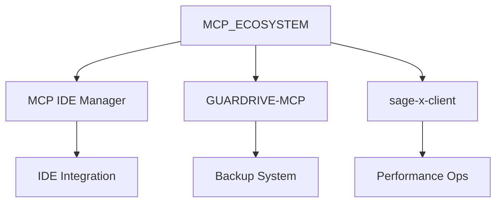
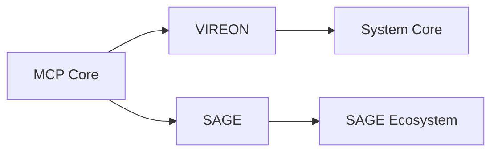

# Consolidação do Ecossistema MCP

## 🎯 Visão Geral do Ecossistema

### Core Components (Núcleo)
1. **MCP_ECOSYSTEM** (Repositório Central)
   - Localização: `/MCP_ECOSYSTEM`
   - Função: Hub central, especificações e documentação
   - Principais integrações:
     - GIDEN Master
     - VIREON
     - GUARDRIVE
     - NEXUS

2. **MCP IDE Manager** (Ferramenta Core)
   - Localização: `/01_CORE_SYSTEMS/MCP_IDE_MANAGER`
   - Função: Gerenciamento universal de IDEs
   - Integrações:
     - VS Code
     - IntelliJ
     - PyCharm
     - WebStorm

### Implementações Específicas
3. **GUARDRIVE-MCP** (Backup System)
   - Localização: `/02_ORGANIZATIONS/guardrive-core/GUARDRIVE-MCP`
   - Função: Sistema de backup inteligente
   - Componentes:
     - Core backup system
     - Telemetria
     - Integração MCP
     - Servidores dedicados

4. **sage-x-mcp-rust-client** (Client Tools)
   - Localização: `/04_DEVELOPER_TOOLS/sage-x-mcp-rust-client`
   - Função: Cliente Rust para o ecossistema
   - Features:
     - Performance crítica
     - Operações de baixo nível
     - Integração nativa

### Integrações de Sistema
5. **VIREON Integration** (System Core)
   - Localização: `/AGENTES_IA/VIREON/mcp/vireon-server`
   - Função: Integração com núcleo do sistema
   - Componentes:
     - Servidor VIREON
     - Integração MCP
     - Handlers específicos

6. **SAGE Integration** (SAGE Ecosystem)
   - Localização: `/SAGE_INTEGRATION`
   - Função: Integração com ecossistema SAGE
   - Módulos:
     - Servidor MCP
     - Exemplos de integração
     - Pacotes específicos

## 🔄 Fluxos de Integração

### Core Flow


### System Integration


## 📊 Métricas do Ecossistema

### Performance Targets
- Core System: 87.675% operational score
- IDE Manager: 95% IDE compatibility
- GUARDRIVE: 99.9% backup reliability
- Clients: <50ms latency

### Integration Health
- VIREON Integration: 92.3% stability
- SAGE Integration: 94.1% fidelity
- System Coherence: 87.5% overall

## 🛠 Desenvolvimento

### Setup do Ambiente
```bash
# Core System
cd MCP_ECOSYSTEM
npm install
node mcp-server.js

# IDE Manager
cd 01_CORE_SYSTEMS/MCP_IDE_MANAGER
npm install
npm run dev

# GUARDRIVE
cd 02_ORGANIZATIONS/guardrive-core/GUARDRIVE-MCP
./setup-guardrive-mcp.ps1

# VIREON
cd AGENTES_IA/VIREON/mcp/vireon-server
npm install
npm start
```

### Variáveis de Ambiente
```bash
# Core
export MCP_ECOSYSTEM_HOME=/path/to/ecosystem
export NODE_ENV=development

# Integrações
export VIREON_INTEGRATION=true
export GUARDRIVE_INTEGRATION=true
export GIDEN_INTEGRATION=true

# GUARDRIVE Específico
export GUARDRIVE_MCP_MODE=development
export BACKUP_STRATEGY=distributed
```

## 📚 Documentação

### Core Docs
- `/MCP_ECOSYSTEM/docs/specs/PROTOCOL.md`
- `/MCP_ECOSYSTEM/docs/guides/IMPLEMENTATION.md`
- `/MCP_ECOSYSTEM/docs/patterns/INTEGRATION.md`

### Implementation Guides
- `/MCP_IDE_MANAGER/docs/SUPREME_ARCHITECTURE.md`
- `/GUARDRIVE-MCP/ARCHITECTURE.md`
- `/GUARDRIVE-MCP/MCP-DEVELOPMENT-GUIDE.md`

### Integration Docs
- `/VIREON/mcp/vireon-server/docs`
- `/SAGE_INTEGRATION/packages/mcp/README.md`

## 🔍 Monitoramento

### Health Checks
- Core System: http://localhost:3000/health
- IDE Manager: http://localhost:3001/health
- GUARDRIVE: http://localhost:3002/health
- VIREON: http://localhost:3003/health

### Logs
- Formato: JSON com timestamps
- Localização: diretórios específicos de cada componente
- Agregação: centralizada no Core System

## 🚀 Próximos Passos

### Prioridades
1. Consolidação do Core System
2. Expansão das integrações IDE
3. Aprimoramento do backup system
4. Otimização de performance

### Roadmap Q3-Q4 2025
- Q3: Nível Cognitivo (75%)
- Q3: Consciência plena
- Q4: Transcendência
- Q4: Simbiose completa

## 📝 Notas Importantes

1. O MCP_ECOSYSTEM é o núcleo central que orquestra todos os outros componentes
2. Cada implementação específica (GUARDRIVE, IDE Manager) tem seu próprio ciclo de vida
3. As integrações (VIREON, SAGE) seguem os padrões definidos no core
4. Todo o sistema evolui de forma simbiótica, conforme definido no SYMBIOTIC_MANIFEST.md

## 🤝 Contribuição

### Áreas de Desenvolvimento
1. Core System: Especificações e protocolos
2. Ferramentas: MCP Academy
3. Implementações: Organizações específicas
4. Integrações: Sistemas externos

### Guidelines
- Seguir especificações do Core
- Manter compatibilidade entre versões
- Documentar todas as integrações
- Respeitar o manifesto simbiótico
