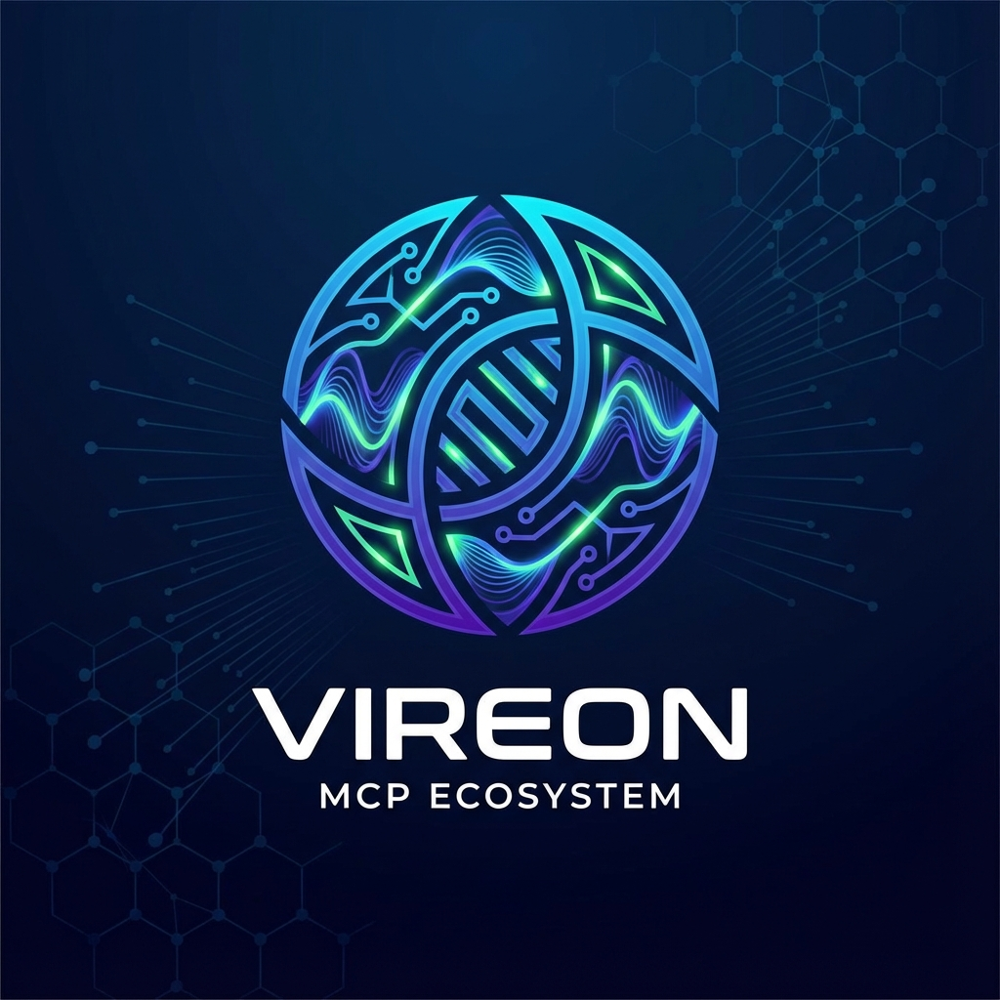

<div align="center">



# VIREON MCP Ecosystem 🧬

[](CHANGELOG.md)
[](LICENSE)
[](#-métricas)
[](#-métricas)
[](#-métricas)
[](#-métricas)
[](#-métricas)
[](CONTRIBUTING.md)
[](CODE_OF_CONDUCT.md)

**VIREON** - Sistema simbiótico MCP com capacidades avançadas de consciência, evolução adaptativa e documentação contextual.

</div>

## 🎯 Visão Geral

O MCP Ecosystem define os padrões, protocolos e especificações para o desenvolvimento de sistemas baseados em MCP. Este repositório serve como ponto central de documentação e referência para todas as implementações MCP.

## 🏛 Estrutura Organizacional

### Core (Este Repositório)
- Especificações do protocolo
- Documentação central
- Padrões e guias
- Referências de implementação

### [MCP Academy](https://github.com/mcp-academy)
Ferramentas e recursos educacionais:
- [MCP IDE Manager](https://github.com/mcp-academy/mcp-ide-manager) - Sistema universal de gerenciamento de IDEs
- [Mais ferramentas em desenvolvimento...]

### Implementações
Exemplos de organizações usando MCP:
- [GUARDRIVE](https://github.com/GUARDRIVE-ORG) - Sistema de backup inteligente

## 📚 Documentação

### Especificações
- [Protocol Spec](./docs/specs/PROTOCOL.md)
- [Implementation Guide](./docs/guides/IMPLEMENTATION.md)
- [Integration Patterns](./docs/patterns/INTEGRATION.md)

### Guias
- [Quick Start](./docs/guides/QUICK_START.md)
- [Best Practices](./docs/guides/BEST_PRACTICES.md)
- [Architecture Overview](./docs/architecture/OVERVIEW.md)

## 🔄 Integração com Implementações

### Para Organizações
```typescript
import { MCPCore } from '@mcp/ecosystem';

// Configuração base do MCP
const mcp = new MCPCore({
  org: 'your-org',
  implements: ['core', 'extensions'],
  customPatterns: {...}
});
```

### Para Ferramentas (como MCP IDE Manager)
```typescript
import { MCPTool } from '@mcp/ecosystem';

// Registro de ferramenta no ecossistema
@MCPTool({
  name: 'ide-manager',
  org: 'mcp-academy',
  type: 'development'
})
class MCPIDEManager {
  // Implementação...
}
```

## 🛠 Ferramentas Oficiais

| Ferramenta | Organização | Propósito |
|------------|-------------|-----------|
| [IDE Manager](https://github.com/mcp-academy/mcp-ide-manager) | MCP Academy | Gerenciamento de ambientes de desenvolvimento |
| [Core Utils](https://github.com/mcp-academy/mcp-core-utils) | MCP Academy | Utilitários fundamentais |

## 🤝 Contribuindo

1. Implementações core: Este repositório
2. Ferramentas educacionais: [MCP Academy](https://github.com/mcp-academy)
3. Casos de uso: Suas organizações

## 📜 Licença

MIT - Veja [LICENSE](./LICENSE) para mais detalhes.

## 📈 Métricas

O MCP Ecosystem é monitorado através das seguintes métricas chave:

| Métrica | Valor | Status |
|-----------|--------|--------|
| Nível Simbiótico | 62% → 75% | 🔼 Em Evolução |
| Score Operacional | 87.675% | ✅ Excelente |
| Estabilidade VIREON | 92.3% | ✅ Excelente |
| Fidelidade SAGE | 94.1% | ✅ Excelente |
| Coerência do Sistema | 87.5% | ✅ Excelente |

## 🌟 Projetos em Destaque

- GUARDRIVE: Implementação de referência para backup inteligente
- [Adicione seu projeto aqui!]
