# MCP Ecosystem 🚀

<div align="center">


**Enterprise-grade Meta Catalyst Protocol ecosystem for intelligent AI agent orchestration**

*The definitive platform for MCP server development, advanced automation, and multi-agent coordination*

[🌐 Live Demo](https://neo-sh1w4.github.io/cognition-mcp/) | [📖 Documentation](./docs/index.md) | [🚀 Quick Start](./docs/guides/quick-start.md) | [🇧🇷 Português](./docs/pt-br/README.md)

</div>

## ✨ Key Features

🤖 **Intelligent Agent Orchestration**: Advanced AI agent coordination with dynamic load balancing, fault tolerance, and intelligent resource allocation

⚡ **Advanced Rule Engine**: Sophisticated automation with conditional workflows, real-time processing, and extensible rule definitions

🔗 **Universal IDE Integration**: Seamless integration with popular development environments through standardized protocols and language servers

📊 **Enterprise Analytics**: Comprehensive monitoring, performance insights, and business intelligence dashboards with real-time metrics

🏗️ **Cloud-Native Architecture**: Microservices-based design with horizontal scaling, container orchestration, and multi-region support

🛡️ **Zero-Trust Security**: End-to-end encryption, role-based access control, and comprehensive audit trails for enterprise compliance

## 📊 Platform Value

### Global Market Position
- **Market Leadership**: First enterprise-grade MCP orchestration platform with production-ready capabilities
- **Technical Differentiation**: Advanced agent coordination and automation capabilities unmatched in the ecosystem
- **Enterprise Ready**: Production-grade reliability, security, and compliance frameworks
- **Global Scalability**: Multi-region deployment architecture with comprehensive localization support

## 🚀 Quick Installation

```bash
# Clone the repository
git clone https://github.com/NEO-SH1W4/cognition-mcp.git
cd cognition-mcp

# Install dependencies
npm install

# Build the project
npm run build

# Start development server
npm run dev

# Run tests
npm test

# Deploy to production
npm run deploy
```

## 💡 Quick Start

### 1. Your First MCP Server
```typescript
import { MCPServer, Tool } from '@mcp-ecosystem/core';

class HelloWorldServer extends MCPServer {
  constructor() {
    super({
      name: 'hello-world-server',
      version: '1.0.0'
    });
    
    this.registerTool(new HelloTool());
  }
}

class HelloTool implements Tool {
  name = 'say_hello';
  description = 'Says hello to a person';
  
  async execute(args: { name?: string }) {
    const name = args.name || 'World';
    return {
      success: true,
      data: `Hello, ${name}! Welcome to MCP Ecosystem!`
    };
  }
}

const server = new HelloWorldServer();
server.start();
```

### 2. Rules Engine Integration
```typescript
import { RulesEngine, Rule } from '@mcp-ecosystem/rules';

const rule: Rule = {
  name: 'auto_respond',
  description: 'Auto-respond to hello messages',
  conditions: [
    {
      field: 'message.content',
      operator: 'contains',
      value: 'hello'
    }
  ],
  actions: [
    {
      type: 'respond',
      template: 'Hello! How can I help you today?'
    }
  ]
};

const rulesEngine = new RulesEngine();
rulesEngine.addRule(rule);
```

### 3. IDE Integration
```typescript
import { IDEIntegrationManager } from '@mcp-ecosystem/ide';

// Universal IDE integration
const ideManager = new IDEIntegrationManager();

// Register development environment
await ideManager.registerEnvironment({
  id: 'dev-environment',
  type: 'code-editor',
  protocols: ['lsp', 'mcp', 'debug-adapter'],
  capabilities: [
    'syntax-highlighting',
    'code-completion', 
    'debugging',
    'agent-integration'
  ]
});

// Enable real-time collaboration
await ideManager.enableCollaboration({
  mode: 'multi-agent',
  sync: 'real-time'
});
```

### 4. Multi-Agent Orchestration
```typescript
import { AgentOrchestrator } from '@mcp-ecosystem/orchestrator';

const orchestrator = new AgentOrchestrator();

// Define agent workflow
const workflow = orchestrator.createWorkflow({
  name: 'code-review-pipeline',
  agents: [
    { id: 'code-analyzer', role: 'analysis' },
    { id: 'security-scanner', role: 'security' },
    { id: 'performance-optimizer', role: 'optimization' }
  ],
  coordination: 'sequential-with-feedback'
});

await orchestrator.executeWorkflow(workflow);
```

## 🧩 Platform Components

### Architecture Overview

```mermaid
graph TB
    subgraph "Client Layer"
        CLI[🖥️ CLI Tools]
        WEB[🌐 Web Dashboard]
        SDK[📦 Client SDKs]
        AGENTS[🤖 AI Agents]
    end

    subgraph "MCP Protocol Layer"
        GATEWAY[🚪 API Gateway]
        ROUTER[🔀 Message Router]
        HANDLER[⚙️ Protocol Handler]
    end

    subgraph "Core Platform"
        SERVER[🤖 MCP Server Framework]
        RULES[⚡ Rules Engine]
        SAGE[🔗 SAGE Integration]
        ORCH[🏗️ Orchestration Layer]
    end

    subgraph "Analytics & Security"
        DASH[📊 Analytics Dashboard]
        MONITOR[📈 Performance Monitor]
        SEC[🛡️ Security Framework]
        AUDIT[📋 Audit Logger]
    end

    subgraph "Infrastructure"
        CACHE[💾 Distributed Cache]
        DB[(🗄️ Database)]
        QUEUE[📮 Message Queue]
        METRICS[📊 Metrics Store]
    end

    CLI --> GATEWAY
    WEB --> GATEWAY
    SDK --> GATEWAY
    AGENTS --> GATEWAY

    GATEWAY --> ROUTER
    ROUTER --> HANDLER
    HANDLER --> SERVER

    SERVER --> RULES
    RULES --> SAGE
    SAGE --> ORCH

    ORCH --> DASH
    DASH --> MONITOR
    MONITOR --> SEC
    SEC --> AUDIT

    SERVER --> CACHE
    RULES --> DB
    SAGE --> QUEUE
    DASH --> METRICS

    style SERVER fill:#ff6b35,stroke:#333,stroke-width:3px
    style RULES fill:#58a6ff,stroke:#333,stroke-width:3px
    style SAGE fill:#3fb950,stroke:#333,stroke-width:3px
    style DASH fill:#a855f7,stroke:#333,stroke-width:3px
```



### Component Status

| Component | Status | Description |
|-----------|--------|-------------|
| 🤖 **MCP Server Framework** | 🚀 Production | Enterprise-grade server implementation with full protocol compliance |
| ⚡ **Advanced Rules Engine** | 🚀 Production | AI-powered automation with machine learning capabilities |
| 🔗 **Universal IDE Integration** | 🚀 Production | Cross-platform development environment support |
| 📊 **Enterprise Analytics** | 🚀 Production | Advanced monitoring and business intelligence dashboards |
| 🏗️ **Cloud Orchestration** | 🚀 Production | Multi-agent coordination and auto-scaling infrastructure |
| 🛡️ **Zero-Trust Security** | 🚀 Production | Enterprise security and compliance framework |

## 📚 Documentation

- 🏃‍♂️ [**Quick Start Guide**](./docs/guides/quick-start.md)
- 🏗️ [**System Architecture**](./docs/architecture/overview.md)
- 🤝 [**Contributing Guide**](./docs/development/contributing.md)
- 📡 [**API Reference**](./docs/api/)
- 🚀 [**Deployment Guide**](./docs/deployment/)
- 🧩 [**Examples**](./docs/examples/)
- 📋 [**Project Roadmap**](./TASKS.md)

## 🛠️ For Developers

### Code Quality
```bash
# Formatting and linting
npm run lint && npm run format

# Tests with coverage
npm run test:coverage

# Type checking
npm run typecheck
```

### Project Structure
```
mcp-ecosystem/
├── src/                     # Source code
│   ├── core/               # Core MCP functionality
│   ├── rules/              # Rules engine
│   ├── sage/               # SAGE integration
│   ├── server/             # Server framework
│   └── shared/             # Shared utilities
├── docs/                   # Documentation
├── examples/               # Example implementations
└── tests/                  # Test files
```

## 🤝 Contributing

Contributions are very welcome! This project has the potential to significantly impact the AI agent development community.

1. 🍴 Fork the project
2. 🌟 Create your feature branch (`git checkout -b feature/amazing-feature`)
3. ✅ Add tests and ensure they pass
4. 📝 Update documentation
5. 🚀 Open a Pull Request

See the [complete contribution guide](./docs/development/contributing.md).

## 🎯 Roadmap

### v0.2.0 (Q1 2025)
- 🔗 Enhanced multi-agent orchestration
- 🧠 Advanced rule engine capabilities
- 🧩 Plugin ecosystem development

### v0.3.0 (Q2 2025)
- 🌐 Web-based management interface
- 📊 Advanced analytics and insights
- 👥 Multi-tenant architecture

### v1.0.0 (Q3 2025)
- 🏢 Enterprise features and support
- 📞 Professional services
- 🚀 Production-ready release

## 📜 License

This project is licensed under the MIT License - see the [LICENSE](LICENSE) file for details.

## 🌟 Acknowledgments

Built with ❤️ for the AI agent development community. Special thanks to:
- The Meta Catalyst Protocol team for the amazing protocol specification
- The TypeScript and Node.js communities for excellent tooling
- All contributors who help make this project better

If this project helped you, consider giving it a ⭐!

---

<div align="center">

**[🏠 Homepage](https://neo-sh1w4.github.io/cognition-mcp/) • [📖 Docs](./docs/index.md) • [🐛 Issues](https://github.com/NEO-SH1W4/cognition-mcp/issues) • [💬 Discussions](https://github.com/NEO-SH1W4/cognition-mcp/discussions)**

</div>
