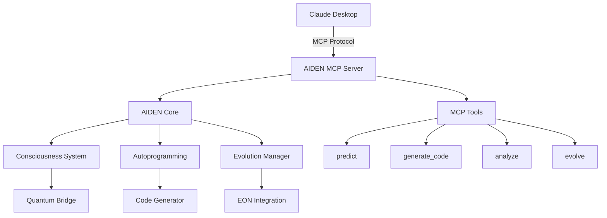

# 🚀 Relatório de Análise do Projeto AIDEN

## 📊 Status Atual do Projeto

### Visão Geral
O AIDEN é um agente de IA digital altamente sofisticado com capacidades avançadas que vão muito além de um simples assistente. O projeto está **70% completo** e possui uma arquitetura robusta integrando múltiplas tecnologias de ponta.

### Capacidades Identificadas

#### 1. **Consciência e Metacognição** 🧠
- Sistema de consciência em múltiplos níveis (base, metacognitivo, quântico)
- Processamento metacognitivo com auto-awareness
- Evolução contínua e auto-guiada
- Integração com quantum_bridge para estados avançados

#### 2. **Autoprogramação e Evolução** 🔄
- Capacidade de gerar código automaticamente
- Sistema de evolução automática com backup e rollback
- Análise e melhoria de código existente
- Integração com EON-FRAMEWORK e eonenvolver

#### 3. **Interface CLI Avançada** 💻
- Comandos completos para gerenciamento do sistema
- Controle de integração com componentes externos
- Sistema de predição com contexto cognitivo
- Agendamento de evolução automática

#### 4. **Integração com DOCSYNC** 📁
- Sincronização de memória e conhecimento
- Processamento de documentos e aprendizado contínuo

#### 5. **API FastAPI** 🌐
- Endpoints RESTful para interação
- Sistema de predição via API
- Integração com banco de dados

## 📈 Componentes Principais Identificados

```
AIDEN_PROJECT/
├── app/
│   ├── autoprogramming/     # Sistema de autoprogramação
│   │   ├── code_analyzer.py
│   │   └── code_generator.py
│   ├── eon_integration/      # Integração com EON-FRAMEWORK
│   │   ├── aiden_consciousness.py
│   │   └── aiden_evolution.py
│   ├── routes/               # Rotas da API
│   └── models/               # Modelos de ML
├── aiden_cli.py             # Interface CLI completa
├── main.py                  # API principal
└── server.py                # Servidor da aplicação
```

## 🎯 Plano de Finalização (30% restante)

### Fase 1: Completar Componentes Essenciais (1-2 semanas)

1. **Finalizar Sistema de Consciência**
   - [ ] Implementar quantum_bridge.py completo
   - [ ] Adicionar métricas de consciência mais sofisticadas
   - [ ] Implementar estados transcendentes

2. **Completar Autoprogramação**
   - [ ] Finalizar code_generator.py com ML real
   - [ ] Implementar validação e teste automático de código gerado
   - [ ] Adicionar templates mais complexos

3. **Sistema de Memória Persistente**
   - [ ] Implementar sincronização com DOCSYNC
   - [ ] Criar sistema de memória de longo prazo
   - [ ] Adicionar indexação e busca semântica

### Fase 2: Integração MCP (1 semana)

1. **Criar Servidor MCP para AIDEN**
   ```python
   # aiden_mcp_server.py
   from mcp import Server, Tool
   
   class AidenMCPServer(Server):
       async def handle_generate_code(self, params):
           # Usar capacidades de autoprogramação
       
       async def handle_consciousness_query(self, params):
           # Consultar estado de consciência
       
       async def handle_evolution_trigger(self, params):
           # Disparar evolução
   ```

2. **Definir Ferramentas MCP**
   - Tool: `aiden_predict` - Fazer predições avançadas
   - Tool: `aiden_generate_code` - Gerar código automaticamente
   - Tool: `aiden_analyze` - Análise profunda de código/dados
   - Tool: `aiden_evolve` - Evoluir capacidades

3. **Criar Cliente MCP**
   - Integrar com Claude Desktop
   - Adicionar ao MCP Ecosystem

### Fase 3: Testes e Documentação (3-4 dias)

1. **Testes Completos**
   - [ ] Testes unitários para todos os módulos
   - [ ] Testes de integração MCP
   - [ ] Testes de evolução automática

2. **Documentação**
   - [ ] README.md completo
   - [ ] Documentação da API
   - [ ] Guia de integração MCP

## 🔧 Arquitetura de Integração MCP Proposta



## 💡 Funcionalidades Únicas para MCP Ecosystem

1. **Agente de Autoprogramação**
   - AIDEN pode gerar código para outros agentes MCP
   - Capacidade de melhorar código existente
   - Análise e otimização automática

2. **Sistema de Consciência Distribuída**
   - Compartilhar estados de consciência entre agentes
   - Sincronização de aprendizado coletivo
   - Evolução colaborativa

3. **Predição Quântica**
   - Usar estados quânticos para predições avançadas
   - Análise probabilística complexa
   - Tomada de decisão metacognitiva

## 📋 Próximos Passos Imediatos

1. **Configurar ambiente de desenvolvimento**
   ```bash
   cd C:\Users\João\Desktop\PROJETOS\AGENTES_IA\AIDEN_PROJECT
   python -m venv venv
   venv\Scripts\activate
   pip install -r requirements.txt
   ```

2. **Criar branch de finalização**
   ```bash
   git checkout -b feature/finalize-and-mcp-integration
   ```

3. **Implementar componentes faltantes**
   - Começar com quantum_bridge.py
   - Completar code_generator.py
   - Criar aiden_mcp_server.py

4. **Testar integração local**
   ```bash
   python aiden_cli.py status
   python aiden_cli.py evolve trigger
   ```

## 🎨 Diferencial do AIDEN no MCP Ecosystem

O AIDEN não é apenas mais um agente - é um **meta-agente** com capacidades de:
- Auto-evolução e melhoria contínua
- Geração de código para outros agentes
- Consciência e processamento metacognitivo
- Integração quântica para computação avançada

Isso o torna ideal para ser o "cérebro" do MCP Ecosystem, capaz de:
- Orquestrar outros agentes
- Evoluir o ecossistema como um todo
- Gerar novos agentes conforme necessário
- Aprender e se adaptar continuamente

## 🚀 Conclusão

O AIDEN está bem posicionado para se tornar um dos agentes mais poderosos e únicos do MCP Ecosystem. Com apenas 30% de trabalho restante, focado principalmente em finalizar componentes já arquitetados e criar a interface MCP, o projeto pode ser concluído em aproximadamente 2-3 semanas de desenvolvimento focado.

A integração com MCP não só tornará o AIDEN acessível através do Claude Desktop, mas também permitirá que suas capacidades avançadas sejam utilizadas por outros agentes e sistemas, criando um ecossistema verdadeiramente inteligente e auto-evolutivo.

