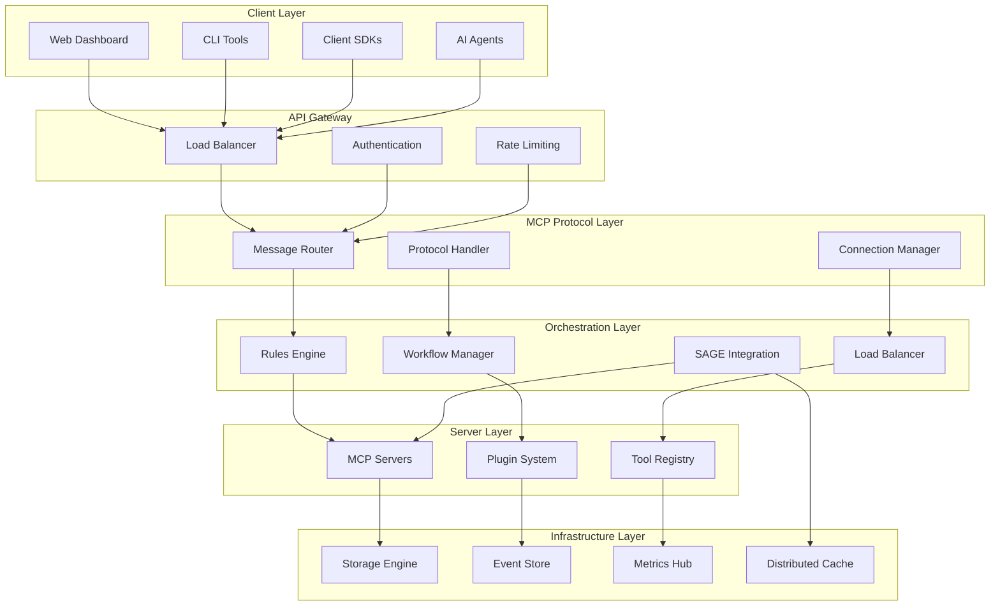
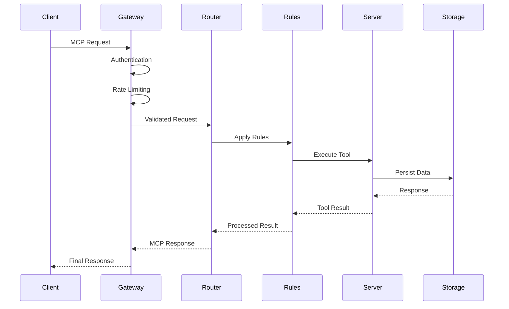
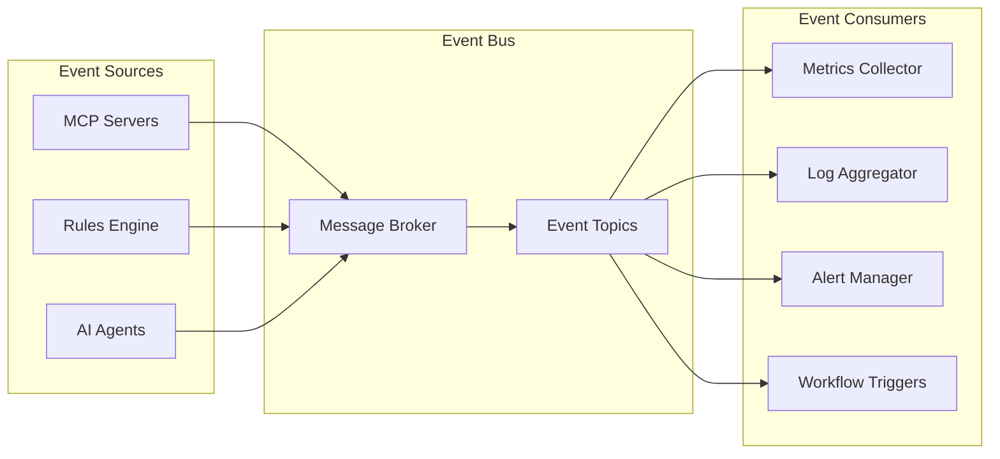
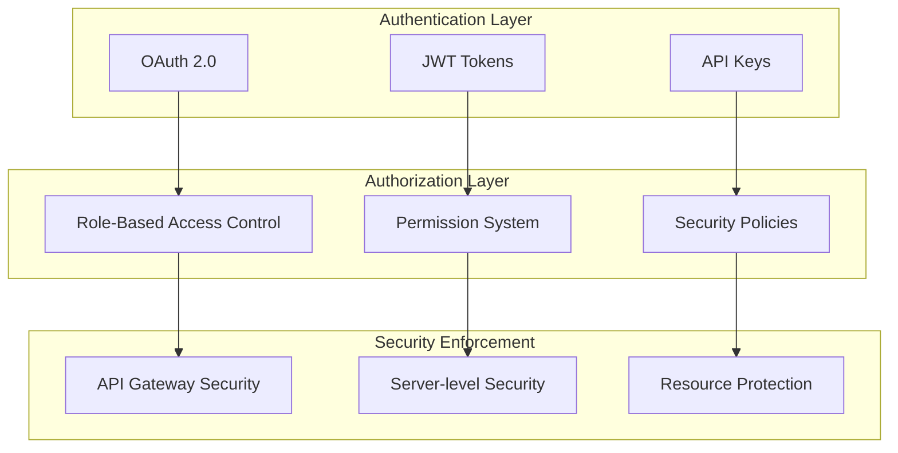
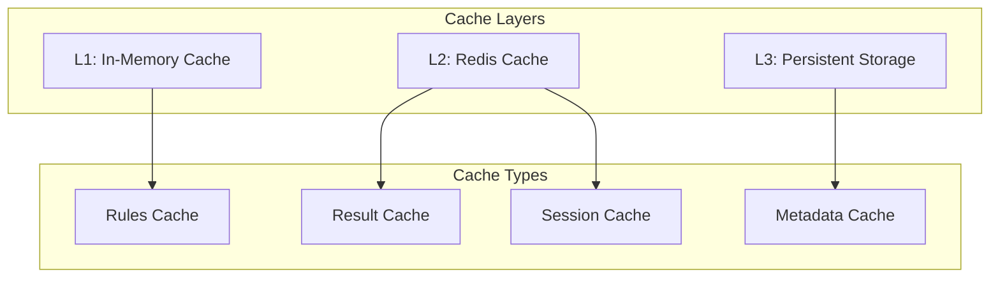

# System Architecture Overview

The MCP Ecosystem is designed as a distributed, scalable platform for Meta Catalyst Protocol (MCP) server orchestration and AI agent coordination. This document provides a comprehensive overview of the system architecture.

## 🏗️ High-Level Architecture



## 🎯 Design Principles

### 1. Modularity
- **Microservices Architecture**: Each component is independently deployable
- **Plugin System**: Extensible architecture through plugins
- **Interface Segregation**: Clean separation of concerns

### 2. Scalability
- **Horizontal Scaling**: Add more instances as needed
- **Load Distribution**: Intelligent load balancing across servers
- **Resource Isolation**: Container-based deployment

### 3. Observability
- **Distributed Tracing**: End-to-end request tracking
- **Metrics Collection**: Comprehensive performance monitoring
- **Structured Logging**: Centralized log aggregation

### 4. Resilience
- **Circuit Breakers**: Prevent cascade failures
- **Health Checks**: Proactive failure detection
- **Graceful Degradation**: Maintain core functionality under stress

## 🏭 Core Components

### 1. MCP Protocol Layer

#### Message Router
```typescript
interface MessageRouter {
  route(message: MCPMessage): Promise<MCPResponse>;
  registerHandler(type: string, handler: MessageHandler): void;
  middleware: MiddlewareStack;
}
```

**Responsibilities:**
- Route incoming MCP messages to appropriate handlers
- Apply middleware for authentication, logging, metrics
- Handle protocol versioning and compatibility

#### Protocol Handler
```typescript
interface ProtocolHandler {
  handle(message: MCPMessage, context: RequestContext): Promise<MCPResponse>;
  supports(version: string): boolean;
}
```

**Responsibilities:**
- Process MCP protocol messages according to specification
- Validate message format and structure
- Handle protocol-specific features

### 2. Orchestration Layer

#### Rules Engine
```typescript
interface RulesEngine {
  evaluate(context: RuleContext): Promise<RuleResult>;
  addRule(rule: Rule): void;
  removeRule(ruleId: string): void;
  listRules(): Rule[];
}
```

**Features:**
- Dynamic rule creation and modification
- Conditional logic evaluation
- Action execution and chaining
- Performance optimization through caching

#### Workflow Manager
```typescript
interface WorkflowManager {
  executeWorkflow(workflow: Workflow, input: WorkflowInput): Promise<WorkflowResult>;
  createWorkflow(definition: WorkflowDefinition): Workflow;
  scheduleWorkflow(workflow: Workflow, schedule: Schedule): void;
}
```

**Capabilities:**
- Multi-step workflow orchestration
- Parallel and sequential execution
- Error handling and retry logic
- Workflow state persistence

### 3. SAGE Integration

#### Integration Manager
```typescript
interface SageIntegrationManager {
  registerAgent(agent: AgentConfig): Promise<void>;
  routeToAgent(message: MCPMessage, agentId: string): Promise<AgentResponse>;
  syncRules(rules: Rule[]): Promise<void>;
}
```

**Features:**
- Seamless AI agent integration
- Rule synchronization with WARP
- Context management and state sharing
- Performance monitoring and optimization

## 🔄 Data Flow Architecture

### 1. Request Processing Flow



### 2. Event-Driven Architecture



## 🔐 Security Architecture

### 1. Authentication & Authorization



### 2. Security Features

- **Encrypted Communication**: TLS 1.3 for all network traffic
- **Token-based Authentication**: JWT with refresh token rotation
- **Fine-grained Authorization**: Resource-level access control
- **Audit Logging**: Comprehensive security event logging
- **Secret Management**: Secure storage and rotation of secrets

## 📊 Performance Architecture

### 1. Caching Strategy



### 2. Performance Optimizations

- **Connection Pooling**: Efficient database and service connections
- **Result Caching**: Cache frequently accessed data
- **Lazy Loading**: Load resources on demand
- **Compression**: Reduce network traffic overhead
- **CDN Integration**: Static asset delivery optimization

## 🚀 Deployment Architecture

### 1. Container Strategy

```yaml
# docker-compose.yml structure
services:
  gateway:
    image: mcp-ecosystem/gateway:latest
    ports: ["8080:8080"]
    
  orchestrator:
    image: mcp-ecosystem/orchestrator:latest
    replicas: 3
    
  mcp-servers:
    image: mcp-ecosystem/server:latest
    replicas: 5
    
  rules-engine:
    image: mcp-ecosystem/rules:latest
    replicas: 2
    
  database:
    image: postgres:15
    volumes: ["db-data:/var/lib/postgresql/data"]
    
  cache:
    image: redis:7-alpine
    
  monitoring:
    image: prometheus:latest
```

### 2. Kubernetes Deployment

```yaml
# Kubernetes deployment example
apiVersion: apps/v1
kind: Deployment
metadata:
  name: mcp-orchestrator
spec:
  replicas: 3
  selector:
    matchLabels:
      app: mcp-orchestrator
  template:
    metadata:
      labels:
        app: mcp-orchestrator
    spec:
      containers:
      - name: orchestrator
        image: mcp-ecosystem/orchestrator:latest
        ports:
        - containerPort: 3000
        resources:
          requests:
            memory: "512Mi"
            cpu: "250m"
          limits:
            memory: "1Gi"
            cpu: "500m"
```

## 📈 Scalability Patterns

### 1. Horizontal Scaling
- **Stateless Services**: All services are designed to be stateless
- **Load Balancing**: Intelligent distribution of requests
- **Auto-scaling**: Automatic scaling based on metrics

### 2. Vertical Scaling
- **Resource Optimization**: Efficient resource utilization
- **Memory Management**: Optimal memory usage patterns
- **CPU Optimization**: Performance-critical code optimization

## 🔍 Monitoring & Observability

### 1. Metrics Collection

```typescript
interface MetricsCollector {
  counter(name: string, labels?: Labels): Counter;
  gauge(name: string, labels?: Labels): Gauge;
  histogram(name: string, buckets: number[], labels?: Labels): Histogram;
  timer(name: string, labels?: Labels): Timer;
}
```

### 2. Key Metrics

- **Business Metrics**: Request rate, success rate, latency
- **System Metrics**: CPU, memory, disk, network usage
- **Application Metrics**: Rule execution time, cache hit rate
- **Custom Metrics**: Domain-specific performance indicators

## 🔄 Future Architecture Considerations

### 1. Planned Enhancements
- **Service Mesh**: Istio integration for advanced traffic management
- **Event Sourcing**: Complete event-driven architecture
- **AI/ML Pipeline**: Integrated machine learning capabilities
- **Multi-region**: Global deployment and data replication

### 2. Technology Evolution
- **WebAssembly**: Plugin execution in sandboxed environments
- **GraphQL**: Flexible API query language support
- **Blockchain**: Decentralized consensus for critical operations

---

This architecture provides a solid foundation for building scalable, maintainable, and high-performance MCP ecosystem deployments while maintaining flexibility for future enhancements and integrations.

