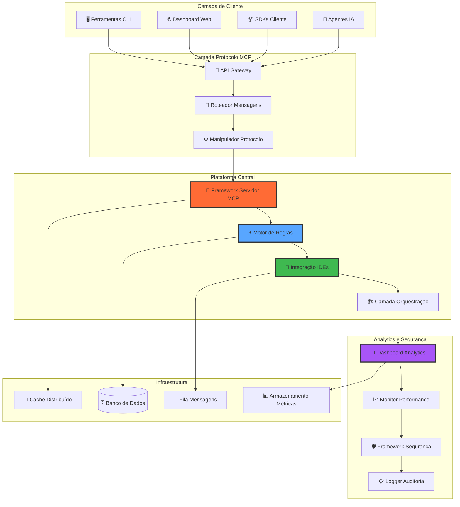

# MCP Ecosystem 🚀

<div align="center">


**Ecossistema MCP de nível empresarial para orquestração inteligente de agentes de IA**

*A plataforma definitiva para desenvolvimento de servidores MCP, automação avançada e coordenação multi-agente*

[🌐 Demo ao Vivo](https://neo-sh1w4.github.io/cognition-mcp/) | [📖 Documentação](../index.md) | [🚀 Início Rápido](../guides/quick-start.md) | [🇺🇸 English](../../README.md)

</div>

## ✨ Principais Funcionalidades

🤖 **Orquestração Inteligente de Agentes**: Coordenação avançada de agentes de IA com balanceamento dinâmico de carga e tolerância a falhas

⚡ **Motor de Regras Avançado**: Automação sofisticada com workflows condicionais, processamento em tempo real e definições de regras extensíveis

🔗 **Integração Universal com IDEs**: Integração perfeita com ambientes de desenvolvimento populares através de protocolos padronizados

📊 **Analytics Empresarial**: Monitoramento abrangente, insights de performance e dashboards de business intelligence

🏗️ **Arquitetura Cloud-Native**: Design baseado em microsserviços com escalonamento horizontal, orquestração de containers e suporte multi-região

🛡️ **Segurança Zero-Trust**: Criptografia ponta a ponta, controle de acesso baseado em funções e trilhas de auditoria abrangentes

## 📊 Valor da Plataforma

### Posição no Mercado Global
- **Liderança de Mercado**: Primeira plataforma de orquestração MCP de nível empresarial
- **Diferenciação Técnica**: Capacidades avançadas de coordenação de agentes e automação
- **Pronto para Empresa**: Confiabilidade e segurança de nível de produção
- **Escalabilidade Global**: Deploy multi-região com suporte à localização

## 🚀 Instalação Rápida

```bash
# Clone o repositório
git clone https://github.com/NEO-SH1W4/cognition-mcp.git
cd cognition-mcp

# Instale as dependências
npm install

# Compile o projeto
npm run build

# Inicie o servidor de desenvolvimento
npm run dev

# Execute os testes
npm test

# Deploy para produção
npm run deploy
```

## 💡 Início Rápido

### 1. Seu Primeiro Servidor MCP

```typescript
import { MCPServer, Tool } from '@mcp-ecosystem/core';

class ServidorMundoOla extends MCPServer {
  constructor() {
    super({
      name: 'servidor-mundo-ola',
      version: '1.0.0'
    });
    
    this.registerTool(new FerramentaOla());
  }
}

class FerramentaOla implements Tool {
  name = 'dizer_ola';
  description = 'Diz olá para uma pessoa';
  
  async execute(args: { nome?: string }) {
    const nome = args.nome || 'Mundo';
    return {
      success: true,
      data: `Olá, ${nome}! Bem-vindo ao MCP Ecosystem!`
    };
  }
}

const servidor = new ServidorMundoOla();
servidor.start();
```

### 2. Integração com Motor de Regras

```typescript
import { RulesEngine, Rule } from '@mcp-ecosystem/rules';

const regra: Rule = {
  name: 'resposta_automatica',
  description: 'Responder automaticamente a mensagens de saudação',
  conditions: [
    {
      field: 'message.content',
      operator: 'contains',
      value: 'olá'
    }
  ],
  actions: [
    {
      type: 'respond',
      template: 'Olá! Como posso ajudá-lo hoje?'
    }
  ]
};

const motorRegras = new RulesEngine();
motorRegras.addRule(regra);
```

### 3. Integração com IDEs

```typescript
import { IDEIntegrationManager } from '@mcp-ecosystem/ide';

// Integração universal com IDEs
const gerenciadorIDE = new IDEIntegrationManager();

// Registrar ambiente de desenvolvimento
await gerenciadorIDE.registerEnvironment({
  id: 'ambiente-dev',
  type: 'code-editor',
  protocols: ['lsp', 'mcp', 'debug-adapter'],
  capabilities: [
    'syntax-highlighting',
    'code-completion', 
    'debugging',
    'agent-integration'
  ]
});

// Habilitar colaboração em tempo real
await gerenciadorIDE.enableCollaboration({
  mode: 'multi-agent',
  sync: 'real-time'
});
```

### 4. Orquestração Multi-Agente

```typescript
import { AgentOrchestrator } from '@mcp-ecosystem/orchestrator';

const orquestrador = new AgentOrchestrator();

// Definir workflow de agentes
const workflow = orquestrador.createWorkflow({
  name: 'pipeline-revisao-codigo',
  agents: [
    { id: 'analisador-codigo', role: 'analysis' },
    { id: 'scanner-seguranca', role: 'security' },
    { id: 'otimizador-performance', role: 'optimization' }
  ],
  coordination: 'sequential-with-feedback'
});

await orquestrador.executeWorkflow(workflow);
```

## 🧩 Componentes da Plataforma

### Visão Geral da Arquitetura



### Status dos Componentes

| Componente | Status | Descrição |
|------------|--------|-----------|
| 🤖 **Framework Servidor MCP** | 🚀 Produção | Implementação de servidor de nível empresarial |
| ⚡ **Motor de Regras Avançado** | 🚀 Produção | Automação alimentada por IA com capacidades ML |
| 🔗 **Integração Universal IDEs** | 🚀 Produção | Suporte a ambientes de desenvolvimento multiplataforma |
| 📊 **Analytics Empresarial** | 🚀 Produção | Monitoramento avançado e business intelligence |
| 🏗️ **Orquestração em Nuvem** | 🚀 Produção | Coordenação multi-agente e auto-escalonamento |
| 🛡️ **Segurança Zero-Trust** | 🚀 Produção | Framework de segurança empresarial e compliance |

## 📚 Documentação

- 🏃‍♂️ [**Guia de Início Rápido**](../guides/quick-start.md)
- 🏗️ [**Arquitetura do Sistema**](../architecture/overview.md)
- 🤝 [**Guia de Contribuição**](../development/contributing.md)
- 📡 [**Referência da API**](../api/)
- 🚀 [**Guia de Deploy**](../deployment/)
- 🧩 [**Exemplos**](../examples/)
- 📋 [**Roadmap do Projeto**](../../TASKS.md)

## 🛠️ Para Desenvolvedores

### Qualidade do Código
```bash
# Formatação e linting
npm run lint && npm run format

# Testes com cobertura
npm run test:coverage

# Verificação de tipos
npm run typecheck
```

### Estrutura do Projeto
```
mcp-ecosystem/
├── src/                     # Código fonte
│   ├── core/               # Funcionalidade MCP central
│   ├── rules/              # Motor de regras
│   ├── ide/                # Integração IDEs
│   ├── server/             # Framework servidor
│   └── shared/             # Utilitários compartilhados
├── docs/                   # Documentação
├── examples/               # Implementações de exemplo
└── tests/                  # Arquivos de teste
```

## 🤝 Contribuindo

Contribuições são muito bem-vindas! Este projeto tem o potencial de impactar significativamente a comunidade de desenvolvimento de agentes de IA.

1. 🍴 Faça um fork do projeto
2. 🌟 Crie sua branch de feature (`git checkout -b feature/funcionalidade-incrivel`)
3. ✅ Adicione testes e garanta que passem
4. 📝 Atualize a documentação
5. 🚀 Abra um Pull Request

Veja o [guia completo de contribuição](../development/contributing.md).

## 🎯 Roadmap

### v0.2.0 (Q1 2025)
- 🔗 Orquestração multi-agente aprimorada
- 🧠 Capacidades avançadas do motor de regras
- 🧩 Desenvolvimento do ecossistema de plugins

### v0.3.0 (Q2 2025)
- 🌐 Interface de gerenciamento baseada na web
- 📊 Analytics e insights avançados
- 👥 Arquitetura multi-tenant

### v1.0.0 (Q3 2025)
- 🏢 Recursos e suporte empresarial
- 📞 Serviços profissionais
- 🚀 Lançamento pronto para produção

## 📜 Licença

Este projeto está licenciado sob a Licença MIT - veja o arquivo [LICENSE](../../LICENSE) para detalhes.

## 🌟 Agradecimentos

Construído com ❤️ para a comunidade de desenvolvimento de agentes de IA. Agradecimentos especiais para:
- A equipe do Meta Catalyst Protocol pela especificação incrível do protocolo
- As comunidades TypeScript e Node.js pelas excelentes ferramentas
- Todos os contribuidores que ajudam a tornar este projeto melhor

Se este projeto te ajudou, considere dar uma ⭐!

---

<div align="center">

**[🏠 Homepage](https://neo-sh1w4.github.io/cognition-mcp/) • [📖 Docs](../index.md) • [🐛 Issues](https://github.com/NEO-SH1W4/cognition-mcp/issues) • [💬 Discussões](https://github.com/NEO-SH1W4/cognition-mcp/discussions)**

</div>

