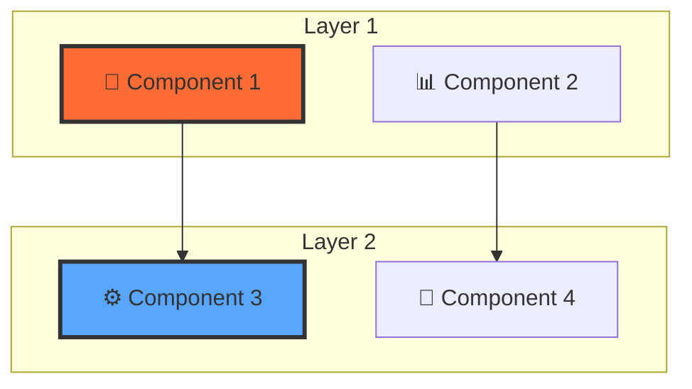
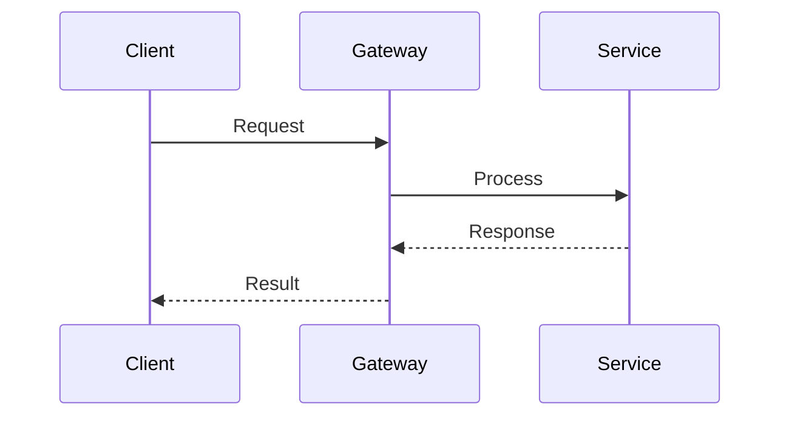

# MCP Documentation Pattern Specification v1.0

## Overview

This document defines the **Enterprise Documentation Pattern** developed for the MCP Ecosystem project. This pattern represents the maximum standard achievable for technical project documentation and can be replicated across projects to ensure consistency, professionalism, and global market readiness.

## Pattern Philosophy

### Core Principles
1. **English-First Global Approach**: English as primary language with strategic localization
2. **Enterprise Visual Hierarchy**: Professional layout with clear information architecture
3. **Interactive Documentation**: Beyond static content - live demos and dynamic elements
4. **Template-Driven Consistency**: Reusable patterns for scalability
5. **Developer-Centric UX**: Optimized for technical audiences and contributors

## Structural Pattern

### Root Level Organization

```
project-root/
├── README.md                     # 🎯 Primary English showcase
├── BLUEPRINT.md                  # 🏗️ Technical architecture overview
├── CHANGELOG.md                  # 📋 Version history (SemVer)
├── CONTRIBUTING.md               # 🤝 Contribution guidelines
├── INTEGRATION_PLAN.md           # 🔗 Integration roadmap
├── MARKET_ANALYSIS.md            # 📊 Business positioning
├── TASKS.md                      # 📋 Project management
├── RELEASE.md                    # 🚀 Release strategy
├── SESSION.md                    # 📝 Session documentation
├── LICENSE                       # 📜 Legal framework
├── index.html                    # 🌐 Interactive homepage
├── styles.css                    # 🎨 Visual design system
├── serve-homepage.js             # ⚙️ Local development server
└── docs/                         # 📚 Comprehensive documentation
```

### Documentation Structure Pattern

```
docs/
├── index.md                      # 🏠 Navigation hub with overview
├── api/                          # 📡 API documentation
│   ├── server.md
│   ├── rules.md
│   ├── clients.md
│   └── websocket.md
├── architecture/                 # 🏗️ System design
│   ├── overview.md              # Complete system architecture
│   ├── protocol.md
│   ├── components.md
│   ├── security.md
│   └── performance.md
├── development/                  # 💻 Developer resources
│   ├── environment.md
│   ├── contributing.md          # Detailed contribution guide
│   ├── code-style.md
│   ├── testing.md
│   └── releases.md
├── deployment/                   # 🚀 Operations
│   ├── docker.md
│   ├── kubernetes.md
│   ├── production.md
│   ├── monitoring.md
│   └── troubleshooting.md
├── guides/                       # 📖 User guides
│   ├── quick-start.md           # Practical getting started
│   ├── installation.md
│   ├── configuration.md
│   ├── best-practices.md
│   └── performance-tuning.md
├── examples/                     # 🧩 Practical examples
│   ├── hello-world.md
│   ├── filesystem.md
│   ├── database.md
│   └── ai-orchestration.md
├── templates/                    # 📋 Reusable templates
│   ├── technical-spec.md        # Technical specification template
│   ├── api-doc.md
│   ├── integration-guide.md
│   └── documentation-pattern-spec.md
└── pt-br/                       # 🇧🇷 Localization
    ├── README.md                # Complete Portuguese version
    └── [mirrored structure]
```

## Content Pattern Specifications

### 1. README.md Pattern (Primary Showcase)

```markdown
# Project Name 🚀

<div align="center">

![Status Badges - Technology, Version, License, Status, i18n]

**Enterprise-grade [technology] ecosystem for [primary value proposition]**

*The definitive platform for [key capabilities]*

[🌐 Live Demo] | [📖 Documentation] | [🚀 Quick Start] | [🇧🇷 Português]

</div>

## ✨ Key Features
[6 core features with icons and descriptions]

## 📊 Platform Value
### Global Market Position
[4 key differentiators]

## 🚀 Quick Installation
[Simple command sequence]

## 💡 Quick Start
[4 practical code examples showing core capabilities]

## 🧩 Platform Components
### Architecture Overview
[Mermaid diagram showing system architecture]

### Component Status
[Table with component status and descriptions]

## 📚 Documentation
[Structured links to all documentation sections]

## 🛠️ For Developers
[Development commands and project structure]

## 🤝 Contributing
[Contribution process overview]

## 🎯 Roadmap
[Version-based roadmap with timelines]

## 📜 License & 🌟 Acknowledgments
[Legal and recognition sections]
```

### 2. docs/index.md Pattern (Navigation Hub)

```markdown
# Project Documentation

[Project overview with badges]

## 🌟 Project Overview
[Comprehensive project description]

## 📚 Documentation Structure
### 🚀 Getting Started
### 🏗️ Architecture & Design  
### 💻 Development
### 📡 API Reference
### 🚀 Deployment & Operations
### 📖 User Guides
### 🧩 Examples
### 📋 Templates

## 🎯 Quick Navigation
### For New Users
### For Developers  
### For Operations

## 🔗 External Resources
[Links to external documentation and resources]

## 🏷️ Version Information
[Current version and update information]
```

### 3. Quick Start Guide Pattern

```markdown
# Quick Start Guide

[Welcome message and prerequisites]

## 🚀 Installation
[Two installation options: clone repo and npm package]

## 🎯 Your First [Primary Component]
[Step-by-step tutorial with code examples]

## 🔧 Basic Configuration
[Configuration examples with YAML/JSON]

## 🎪 Adding More Features
[Progressive feature examples]

## 📊 Monitoring & Observability
[Built-in monitoring setup]

## 🐳 Docker Deployment
[Simple containerization example]

## 🎯 Next Steps
[Clear progression path with links]

## ❓ Need Help?
[Support resources and community links]
```

### 4. Architecture Overview Pattern

```markdown
# System Architecture Overview

[Introduction and scope]

## 🏗️ High-Level Architecture
[Comprehensive Mermaid diagram with multiple layers]

## 🎯 Design Principles
[4 core design principles with explanations]

## 🏭 Core Components
[Detailed component descriptions with interfaces]

## 🔄 Data Flow Architecture
[Sequence diagrams and event-driven patterns]

## 🔐 Security Architecture
[Security layers and frameworks]

## 📊 Performance Architecture
[Caching strategies and optimizations]

## 🚀 Deployment Architecture
[Container and Kubernetes examples]

## 📈 Scalability Patterns
[Horizontal and vertical scaling approaches]

## 🔍 Monitoring & Observability
[Metrics collection and key metrics]

## 🔄 Future Architecture Considerations
[Planned enhancements and technology evolution]
```

## Visual Design System

### Badge Standards
```markdown


```

### Color Scheme
- **Primary**: #ff6b35 (MCP Orange)
- **Secondary**: #58a6ff (Protocol Blue)  
- **Success**: #3fb950 (Success Green)
- **Accent**: #a855f7 (Purple)
- **Neutral**: #8b949e (Gray)

### Icon System
- 🚀 Launch/Start
- 📊 Analytics/Data
- 🏗️ Architecture
- 💻 Development
- 🔗 Integration
- 🛡️ Security
- ⚡ Performance
- 🌐 Global/Web

## Mermaid Diagram Patterns

### Architecture Diagram Template


### Sequence Diagram Template


## Multilingual Strategy

### English-First Approach
1. **Primary Content**: All main documentation in English
2. **Professional Tone**: Enterprise-grade messaging
3. **Technical Accuracy**: Precise technical terminology
4. **Global Appeal**: International market positioning

### Strategic Localization
1. **Complete Translation**: Full documentation in target language
2. **Cultural Adaptation**: Local market considerations
3. **Separate Structure**: Isolated in `docs/[locale]/` directory
4. **Cross-Linking**: Bidirectional navigation between languages

## Interactive Elements

### Homepage Integration
- **Live Demo**: Functional demonstration of capabilities
- **Analytics Dashboard**: Real-time metrics and performance
- **Interactive Diagrams**: Clickable architecture components
- **Animated Backgrounds**: Professional visual effects

### Dynamic Content
- **Status Badges**: Real-time project status
- **Version Information**: Automatically updated versions
- **Contribution Stats**: Live contributor metrics
- **Download Counters**: Package download statistics

## Template Usage Guidelines

### When to Use This Pattern
1. **Enterprise Projects**: Professional-grade technical projects
2. **Open Source Libraries**: Projects seeking wide adoption
3. **Platform Products**: Multi-component systems
4. **Developer Tools**: Tools targeting technical audiences
5. **Global Products**: Projects with international reach

### Adaptation Guidelines
1. **Maintain Structure**: Keep organizational hierarchy
2. **Customize Content**: Adapt to project-specific needs
3. **Preserve Quality**: Maintain professional standards
4. **Update Templates**: Evolve with project growth
5. **Ensure Consistency**: Apply patterns uniformly

## Implementation Checklist

### Phase 1: Foundation
- [ ] Create root-level structure
- [ ] Implement README.md pattern
- [ ] Set up docs/ hierarchy
- [ ] Configure GitHub Pages
- [ ] Add basic templates

### Phase 2: Content Development
- [ ] Write comprehensive architecture documentation
- [ ] Create practical quick start guide
- [ ] Develop contributing guidelines
- [ ] Add code examples and tutorials
- [ ] Implement interactive homepage

### Phase 3: Enhancement
- [ ] Add multilingual support
- [ ] Create visual diagrams
- [ ] Implement status tracking
- [ ] Add advanced templates
- [ ] Optimize for SEO and discoverability

### Phase 4: Maintenance
- [ ] Regular content updates
- [ ] Version synchronization
- [ ] Community feedback integration
- [ ] Performance monitoring
- [ ] Continuous improvement

## Quality Metrics

### Content Quality
- **Readability**: Flesch-Kincaid score > 60
- **Completeness**: All sections documented
- **Accuracy**: Technical content verified
- **Consistency**: Style guide adherence
- **Freshness**: Regular updates maintained

### User Experience
- **Navigation**: < 3 clicks to any content
- **Load Time**: < 2 seconds page load
- **Mobile**: Responsive design
- **Accessibility**: WCAG 2.1 compliance
- **Search**: Full-text search capability

### Technical Excellence
- **Validation**: Markdown linting passed
- **Links**: No broken internal/external links
- **Images**: Optimized and accessible
- **Code**: Syntax highlighted and tested
- **Diagrams**: Rendered correctly across platforms

## Success Indicators

### Adoption Metrics
- Documentation page views
- Quick start completion rate
- Contribution guide usage
- External project adoptions
- Community engagement levels

### Quality Indicators
- User feedback scores
- Documentation issue reports
- Time to first contribution
- Developer onboarding speed
- Support ticket reduction

## Conclusion

This documentation pattern represents the synthesis of enterprise best practices, developer experience optimization, and global market positioning. It serves as both a template and a standard for creating world-class technical documentation that drives adoption, enables contribution, and establishes market leadership.

The pattern is designed to be:
- **Scalable**: Grows with project complexity
- **Maintainable**: Easy to update and extend
- **Professional**: Enterprise-grade presentation
- **Global**: International market ready
- **Accessible**: Developer and user friendly

By following this specification, projects can achieve documentation excellence that matches Fortune 500 standards while maintaining the agility and innovation of modern technical products.

---

**Pattern Version**: 1.0.0  
**Last Updated**: 2025-07-02  
**Next Review**: 2025-10-02  
**Maintainer**: MCP Ecosystem Team

