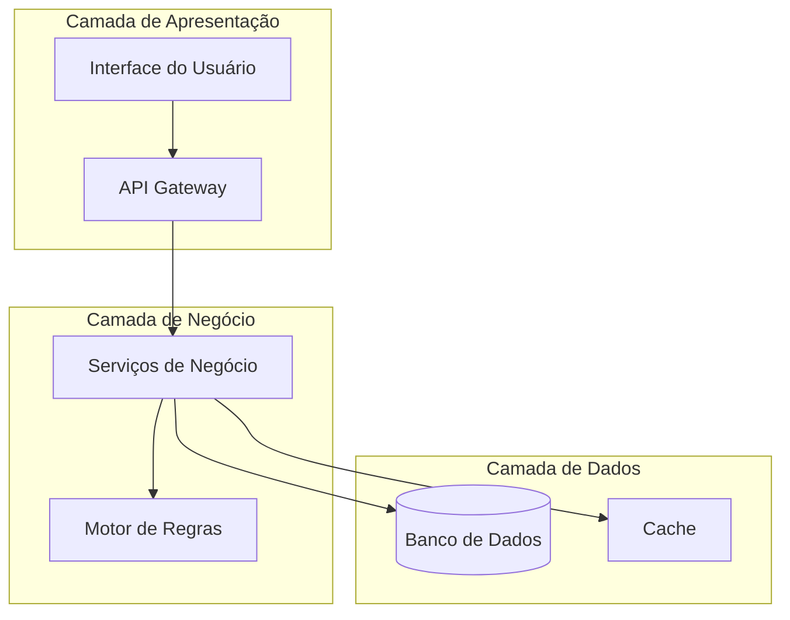

# Especificação Técnica - {COMPONENTE/FEATURE}

## Sumário Executivo

[Breve descrição do componente ou sistema, não mais que 2 parágrafos. Explique o propósito, benefícios principais e contexto dentro do MCP Ecosystem]

## Contexto

### Problema
[Descrição clara do problema que está sendo resolvido. Inclua:]
- Situação atual
- Limitações existentes
- Impacto no sistema/usuários

### Escopo
[Definição clara do que está e não está no escopo desta especificação:]
- **Incluído**: Lista do que será implementado
- **Excluído**: Lista do que não será implementado
- **Dependências**: Componentes ou recursos necessários

## Requisitos

### Funcionais
- **REQ-F01**: [Descrição do requisito funcional]
- **REQ-F02**: [Descrição do requisito funcional]
- **REQ-F03**: [Descrição do requisito funcional]

### Não-Funcionais
- **Performance**: [Requisitos de performance específicos]
- **Segurança**: [Requisitos de segurança]
- **Escalabilidade**: [Requisitos de escala]
- **Compatibilidade**: [Requisitos de compatibilidade]
- **Usabilidade**: [Requisitos de experiência do usuário]

## Arquitetura

### Visão Geral
[Diagrama e descrição da arquitetura do componente]



### Componentes Principais

#### 1. {Nome do Componente A}
- **Função**: [Descrição da função principal]
- **Interfaces**: [APIs ou interfaces expostas]
- **Dependências**: [Outros componentes necessários]
- **Tecnologias**: [Tecnologias específicas utilizadas]

#### 2. {Nome do Componente B}
- **Função**: [Descrição da função principal]
- **Interfaces**: [APIs ou interfaces expostas]
- **Dependências**: [Outros componentes necessários]
- **Tecnologias**: [Tecnologias específicas utilizadas]

## Implementação

### Tecnologias

| Categoria | Tecnologia | Versão | Justificativa |
|-----------|------------|--------|---------------|
| Linguagem | TypeScript | 5.3+ | Type safety e compatibilidade |
| Runtime | Node.js | 18+ | Performance e ecosystem |
| Framework | [Framework] | [Versão] | [Razão da escolha] |
| Banco de Dados | [DB] | [Versão] | [Razão da escolha] |

### Estrutura de Código

```
src/
├── {componente}/
│   ├── index.ts              # Exportações principais
│   ├── types.ts              # Definições de tipos
│   ├── {componente}.ts       # Implementação principal
│   ├── {sub-componente}.ts   # Sub-componentes
│   └── __tests__/            # Testes unitários
│       ├── {componente}.test.ts
│       └── fixtures/         # Dados de teste
```

### Interfaces Principais

```typescript
// Exemplo de interface principal
interface {ComponenteInterface} {
  /**
   * Descrição do método principal
   * @param param1 Descrição do parâmetro
   * @param param2 Descrição do parâmetro
   * @returns Descrição do retorno
   */
  methodoPrincipal(param1: Type1, param2: Type2): Promise<ReturnType>;
  
  /**
   * Método de configuração
   * @param config Configuração do componente
   */
  configure(config: ComponentConfig): void;
}

interface ComponentConfig {
  readonly propriedade1: string;
  readonly propriedade2: number;
  readonly opcoes?: OptionalConfig;
}
```

### Detalhes de Implementação

#### Fluxo Principal
1. [Passo 1 do fluxo]
2. [Passo 2 do fluxo]
3. [Passo 3 do fluxo]

#### Algoritmos Específicos
[Descrição de algoritmos complexos ou específicos]

#### Otimizações
[Otimizações específicas implementadas]

## Integração com MCP Protocol

### Mensagens MCP Suportadas
- **{message_type_1}**: [Descrição do suporte]
- **{message_type_2}**: [Descrição do suporte]

### Extensões do Protocol
[Se aplicável, descrever extensões específicas ao protocolo MCP]

```typescript
// Exemplo de extensão de mensagem MCP
interface CustomMCPMessage extends MCPMessage {
  type: "custom/{message_type}";
  params: {
    customParam1: string;
    customParam2: number;
  };
}
```

## Considerações de Segurança

### Autenticação
- [Mecanismos de autenticação implementados]
- [Integração com sistema de auth existente]

### Autorização
- [Controles de acesso implementados]
- [Políticas de autorização]

### Proteção de Dados
- [Criptografia de dados em trânsito]
- [Criptografia de dados em repouso]
- [Sanitização de inputs]

### Auditoria
- [Eventos de auditoria logados]
- [Formato dos logs de auditoria]

## Testes

### Estratégia de Testes
[Abordagem geral para testes do componente]

### Tipos de Teste

#### Testes Unitários
- **Cobertura**: Mínimo 90%
- **Ferramentas**: Jest, Testing Library
- **Foco**: Lógica de negócio, funções puras

#### Testes de Integração
- **Escopo**: Integração com outros componentes
- **Ferramentas**: Supertest, Test Containers
- **Cenários**: [Cenários específicos testados]

#### Testes de Performance
- **Métricas**: [Métricas de performance monitoradas]
- **Benchmarks**: [Benchmarks estabelecidos]
- **Ferramentas**: [Ferramentas de teste de performance]

### Cenários de Teste

#### Casos de Sucesso
1. [Cenário de sucesso 1]
2. [Cenário de sucesso 2]

#### Casos de Erro
1. [Cenário de erro 1]
2. [Cenário de erro 2]

#### Casos Extremos
1. [Caso extremo 1]
2. [Caso extremo 2]

## Monitoramento e Observabilidade

### Métricas

#### Métricas de Negócio
- **{metric_name}**: [Descrição e importância]
- **{metric_name}**: [Descrição e importância]

#### Métricas Técnicas
- **Latência**: Tempo de resposta médio
- **Throughput**: Requisições por segundo
- **Erro Rate**: Taxa de erro por minuto
- **Utilização de Recursos**: CPU, memória, etc.

### Logging

#### Estrutura de Logs
```json
{
  "timestamp": "2025-07-02T20:00:00Z",
  "level": "info",
  "service": "{component_name}",
  "traceId": "trace-123",
  "spanId": "span-456",
  "message": "Operation completed successfully",
  "context": {
    "operationId": "op-789",
    "userId": "user-123",
    "duration": 150
  }
}
```

#### Níveis de Log
- **ERROR**: Erros que impedem a operação
- **WARN**: Situações que merecem atenção
- **INFO**: Informações gerais de operação
- **DEBUG**: Informações detalhadas para debugging

### Alertas
- **Alerta de Performance**: Quando latência > X ms
- **Alerta de Erro**: Quando taxa de erro > Y%
- **Alerta de Recurso**: Quando utilização > Z%

## Deployment

### Estratégia de Deploy
[Estratégia de deployment específica para o componente]

### Configuração

#### Variáveis de Ambiente
```bash
# Configurações essenciais
COMPONENT_PORT=3000
COMPONENT_LOG_LEVEL=info
COMPONENT_CACHE_TTL=300

# Configurações de banco
DB_HOST=localhost
DB_PORT=5432
DB_NAME=mcp_ecosystem
```

#### Arquivos de Configuração
```yaml
# config/component.yaml
component:
  name: "{component_name}"
  version: "1.0.0"
  
performance:
  maxConnections: 100
  timeoutMs: 5000
  
cache:
  enabled: true
  ttlSeconds: 300
```

### Health Checks
```typescript
interface HealthCheck {
  status: "healthy" | "unhealthy" | "degraded";
  timestamp: string;
  checks: {
    database: boolean;
    cache: boolean;
    externalServices: boolean;
  };
  metadata: {
    version: string;
    uptime: number;
  };
}
```

## Migração e Compatibilidade

### Estratégia de Migração
[Se aplicável, como migrar de versões anteriores]

### Compatibilidade
- **Backward Compatibility**: [Garantias de compatibilidade]
- **API Versioning**: [Estratégia de versionamento]
- **Breaking Changes**: [Como são tratadas]

## Referências

### Documentação
- [MCP Protocol Specification](https://modelcontextprotocol.io/docs)
- [TypeScript Documentation](https://www.typescriptlang.org/docs/)
- [Node.js Documentation](https://nodejs.org/docs/)

### Recursos Externos
- [Link para recurso relevante 1]
- [Link para recurso relevante 2]

### Especificações Relacionadas
- [Link para outras especificações do projeto]

## Histórico de Revisões

| Versão | Data | Autor | Mudanças |
|--------|------|-------|----------|
| 1.0 | {DATA} | {AUTOR} | Versão inicial |
| 1.1 | {DATA} | {AUTOR} | [Descrição das mudanças] |

---

## Anexos

### Anexo A: Diagramas Detalhados
[Diagramas técnicos detalhados]

### Anexo B: Exemplos de Código
[Exemplos de implementação ou uso]

### Anexo C: Benchmarks
[Resultados de testes de performance]

---

> **Nota**: Esta especificação é um documento vivo e deve ser atualizada conforme a implementação evolui. Mudanças significativas devem ser discutidas com a equipe antes da implementação.

